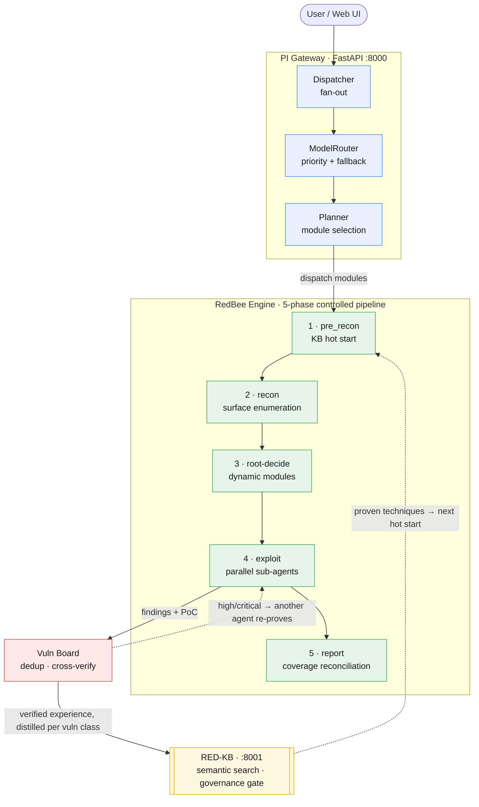

# RedBee — Self-Built AI Penetration-Testing Agent

> Give it a target: it reconnoiters, exploits, and writes the report with PoC + evidence — all on its own.
> **After every run, successful techniques are distilled into the knowledge base per vulnerability class, so the next similar target goes faster and sharper.**

[English](README.md) | [简体中文](README.zh-CN.md)

[](LICENSE)

---

## The Big Picture



**In one line**: AI pentesting isn't about "running it once" — it's about **getting better with every run**: experience automatically accumulates into a knowledge-base asset.

---

## Why This Project

AI pentesting today has three structural problems that remain unsolved:

| Problem | Symptoms | Root Cause |
|---|---|---|
| **Unstable** | Model stalls, wanders, retries forever, doesn't converge for hours | Handing the entire "pentest" to an unconstrained LLM, no controlled boundaries |
| **No memory** | Every new target/environment starts from scratch; experience sits unused in reports | No persistent knowledge base, or the KB is decoupled from the execution path |
| **Untrustworthy validation** | The AI claims it found things; high false-positive rate | Discoverer = verifier, no independent reproduction |

**Our thesis**: penetration testing is an *experience business*. Systematizing, reusing, and accumulating experience is the core competitiveness of AI pentesting — not who has the longer prompt or the bigger toolbox.

---

## Field Results

### Real-Vulnerability Range (DVWA)
- **33 findings** (4 critical / 19 high / 9 medium / 1 low)
- Coverage: SQLi (error + blind) / XSS (reflected + stored) / Upload→RCE / Brute Force / Session / Command Injection / CSRF / IDOR / CAPTCHA / Misconfiguration

### OWASP LLM Top 10 (llmvault)
- All 10 core labs solved within a single session
- `core_done:true`, 2400 points, every flag extracted from live responses

### Knowledge Base (RED-KB)
- **1,517** knowledge entries (630 attack_primitive / 881 poc) + 147 attack cases
- One full engagement → **all 10 general technique classes flow back as authoritative**; `kb_query` top-hits every class

> **No cold-start gap**: the repo ships with `redkb.seed` — 175 battle-tested skills + the seeded knowledge base above — useful from the very first run. Every run afterwards flows experience back and thickens the base.

---

## Core Features

### Knowledge Reflux Loop

```
engagement → submit_finding (with PoC + evidence) → governance gate (has a working PoC?)
  → distill per vulnerability class → promote to authoritative → next kb_query hit → hot start
```

**Iron rule**: only field experience with a working PoC + evidence enters the KB. "Suspected vuln" chatter stays out.

That makes this not a disposable tool, but an **asset that grows stronger with use**.

### The Four Guardrails

1. **Input validation**: all tool-call parameters validated, friendly errors
2. **Output truncation**: tool output capped at 8000 chars, prevents context bloat
3. **Context compaction**: triggered by total size (80000), swaps oldest tool outputs for placeholders
4. **Skill-injection truncation**: large skills (23K+) take the first 8000 chars

### 63 Tools + OpenAI Function Calling

Tools are layered by domain: filesystem (read/bash/edit) → pentest tools (nmap/sqlmap/terminal) → browser (playwright) → DB ops (memory/findings) → KB queries (kb_query/store) → HTTP requests.

The LLM decides which tool to call via structured function calling — not the unreliable "model emits JSON text" approach.

### 175-Skill Library

Loaded on demand via the `list_skills` / `load_skill` tools, covering:
- **vulnerabilities** (87): SQLi / XSS / SSRF / Auth Bypass / IDOR / RCE, etc.
- **reconnaissance**: info gathering, port scanning, subdomain enumeration
- **reporting**: Triage 7-Question Gate, report templates, evidence hygiene
- **enterprise**: M365, Okta, vCenter, cloud IAM
- **methodology**: Bug Bounty methodology, SRC hunting, pentest workflows
- **tooling**: nmap / sqlmap / nuclei / httpx / ffuf command-line playbooks
- **protocols**: GraphQL / WebSocket / OAuth
- **technologies**: Django / Express / FastAPI / Next.js / cloud services
- **cloud**: AWS / Azure / GCP / Kubernetes

### Skills vs RED-KB: Two Carriers of Experience

Skills and RED-KB are two different kinds of experience assets, working together in every task:

> **Skills = the textbook (static); RED-KB = the field diary (dynamic).**

|  | **Skills** (175 .md files) | **RED-KB** (1500+ entries + case library) |
|---|---|---|
| **What** | Methodology / operations manuals | Proven success + validated PoCs |
| **Source** | Distilled from open-source engines and public disclosure reports (Strix / Shannon / Claude-BugHunter) | **Auto-reflux from our own engagements** — grows a bit with every run |
| **Changes?** | ❌ Static, human-curated | ✅ Auto-growing: findings enter as pocs during a run + distilled into general techniques at close-out |
| **How to query** | `load_skill("sql-injection")` — **by name** | `kb_query("how to bypass JWT")` — **semantic search** (vector similarity) |
| **Content** | "How this vuln class is generally attacked, which tools, what to watch for" | "Last time we actually broke through this class with this PoC (de-identified, transferable across targets)" |
| **Governance** | Human curation | Gates: verified / sanitized / scope — unverified experience is blocked from search |

**How they cooperate in one task**:

1. On dispatch, the **module skill** is auto-injected into the sub-agent's prompt (sqli module → sql-injection textbook)
2. During the run the agent `kb_query`s the **field diary** ("how did we break this situation before?")
3. Finding produced → **refluxed into RED-KB** (skills never change)
4. Next task: textbook unchanged, diary thicker → same class broken faster

Analogy: Skills are the internal-medicine textbook; RED-KB is the attending physician's own case notebook — the textbook teaches general principles, the notebook records "how I actually cured this patient" — and only cases truly cured, with evidence, make it into the notebook.

### Model Routing + Automatic Fallback

```python
# .env config
MODEL_PRIORITY=your-primary-model,your-backup-model
# primary dies → auto-fall back to backup, no code change
```

---

## Use Cases

This is not a "CTF solver". It targets the **full real-world pentest workflow**:

| Scenario | How |
|---|---|
| **Web app pentest** | `POST /api/task {target, session_id, task: "full-module pentest"}` |
| **API security testing** | Provide an OpenAPI schema; auto-enumerates endpoints and attacks OWASP API Top 10 |
| **LLM app security** | Break through an LLM range class by class per OWASP LLM Top 10 |
| **Enterprise asset recon** | Given an IP/domain, auto-enumerate attack surface + verify vulns |
| **Continuous knowledge accumulation** | Every engagement refluxes into the KB; the team shares experience |

Known targets (those with a `data/targets/<id>.md` profile, e.g. dvwa/juice) skip recon and hot-start directly when `PIMETA_KNOWN_FAST=1`. For real targets just give a URL or IP; after the run a target profile is auto-deposited, so the next similar target is faster.

---

## Quick Start

### Prerequisites

- Python 3.11+
- pip
- **An OpenAI-compatible LLM endpoint + API key** (required; e.g. vLLM / DeepSeek / OpenAI)
- An embedding endpoint (optional; without it RED-KB semantic search degrades to keyword search)
- Docker (**strongly recommended**: the Kali attack sandbox runs as a Docker container, and exploit tools like sqlmap/terminal depend on it; without Docker only HTTP/browser/host-nmap style recon is available)
- nmap (host side, `apt install nmap`)

### 1. Clone and Install Dependencies

```bash
git clone <repo-url>
cd <repo>
pip install -r platform/requirements.txt
python -m playwright install chromium --with-deps   # for the browser tool (skip if not using the browser)
```

### 2. Configure

```bash
cp platform/config.example.env platform/.env
# fill in the LLM endpoint/key (section 1, required); embedding endpoint (section 2, optional)
```

### 3. Build the Kali Attack Sandbox Image (skip for Docker deployment — compose builds it)

```bash
docker build -f Dockerfile.kali -t redbee-kali:local .
```

### 4. Initialize the Knowledge Base + Start Services

```bash
cd platform
python3 -m redkb.seed          # initialize RED-KB (idempotent, safe to re-run)
bash run.sh                    # start RED-KB(:8001) + PI gateway(:8000)
```

`run.sh` starts both services in one shot. If you need separated mode:
```bash
bash start_redkb.sh   # RED-KB :8001 (detached, binds 0.0.0.0)
bash start_pimeta.sh  # PI gateway :8000 (detached, binds 0.0.0.0)
```
`start_*.sh` bind `0.0.0.0`, directly reachable from LAN/containers.

### 5. Prepare a Target (Optional)

The engine attacks **any authorized target** (URL / IP). To practice on public ranges first, use the official images (this repo does not bundle range source):

```bash
# DVWA (classic web vuln range; log in admin/password, click "Create/Reset Database" first)
docker run -d -p 8081:80 citizenstig/dvwa

# OWASP Juice Shop
docker run -d -p 3000:3000 bkimminich/juice-shop
```

Or point it at your own deployed target.

### 6. Dispatch a Task

```bash
curl -X POST http://127.0.0.1:8000/api/task \
  -H "Content-Type: application/json" \
  -d '{
    "target": "http://127.0.0.1:8081",
    "target_id": "dvwa",
    "session_id": "my-first-session",
    "task": "Run a full-module penetration test against the target"
  }'
```

### 7. Watch Progress

```bash
# live snapshot
curl http://127.0.0.1:8000/api/task/{task_id}/live

# SSE stream push (recommended)
curl -N http://127.0.0.1:8000/api/task/{task_id}/stream

# vulnerability board
curl http://127.0.0.1:8000/api/task/{task_id}/board
```

---

## Docker Deployment

Images are built automatically by [GitHub Actions](./.github/workflows/ci.yml); tagging `v*` publishes them to GHCR.

### Pull from Release (recommended, no local build)

```bash
cp platform/config.example.env platform/.env   # fill in your real LLM key

# point at the CI-published images (platform + Kali sandbox; multi-arch built on v* tags)
export REDBEE_IMAGE=ghcr.io/<your-org>/<repo>:latest
export REDBEE_KALI_IMAGE=ghcr.io/<your-org>/<repo>/redbee-kali:latest

# pre-pull the Kali sandbox image (the gateway uses it to run attack commands)
docker compose --profile sandbox pull

# pull and start gateway + RED-KB
docker compose pull gateway redkb
docker compose up -d
```

### Local Build (development/contribution)

```bash
cp platform/config.example.env platform/.env
# build the Kali sandbox image (self-contained: Dockerfile.kali, based on public kalilinux/kali-rolling)
docker compose --profile sandbox build
docker compose up -d --build
```

> **Image release paths**: defaults are `REDBEE_IMAGE=redbee:local`, `REDBEE_KALI_IMAGE=redbee-kali:local`
> (local build); after release, set `ghcr.io/<your-org>/<repo>` to pull from GHCR.
> Multi-arch (amd64/arm64) is built by CI. The Kali sandbox image is self-contained and
> reproducibly buildable; you can also point `HINSE_DOCKER_IMAGE` at any working Kali image.

### Networking Notes (how it hits ranges under docker)

- The gateway container uses the mounted host Docker socket (`/var/run/docker.sock`) to start the
  Kali sandbox (e.g. `inhouse-sess-*`, `--network bridge`) via the **host daemon** — the sandbox is a
  **sibling container** of the host, so target networking (e.g. the host's docker bridge) behaves
  **identically** to running from source. No regression.
- The only change: inside the gateway container, RED-KB is reached via the compose service name
  `redkb:8001` (already wired in compose), not `127.0.0.1` (container loopback can't reach another service).

---

## Project Structure

```
platform/
├── pi_meta/                  # PI meta-gateway (FastAPI)
│   ├── app.py                # Web / sessions / tasks / reports
│   ├── orchestrator.py       # vuln-board coordination (post/dedup/dispatch re-proof)
│   ├── board.py              # findings board
│   ├── planner.py            # module selection
│   ├── model_router.py       # model routing + auto fallback
│   └── real_dispatch.py      # engine dispatch
├── agents/
│   ├── executor.py           # InhouseAgent (ReAct loop + guardrails + memory)
│   ├── orchestrator_v2.py    # 5-phase controlled orchestration
│   └── skills/               # 175-skill library
├── redkb/                    # RED-KB knowledge-base service (:8001)
├── auto_ingest.py            # knowledge reflux loop (task done → distill per vuln class → ingest)
├── config.py                 # unified config (reads .env)
├── requirements.txt
└── tests/
```

`data/` is runtime data (`redkb.db` knowledge base + `targets/<id>.md` target profiles), auto-created on first run, not committed.

---

## Design Docs

Architecture and knowledge-base design details live in the project Wiki / Issues. Core modules (`pi_meta/`, `agents/`, `redkb/`) also carry docstrings explaining their design.

Hit a snag self-deploying? Start with **[TROUBLESHOOTING.md](TROUBLESHOOTING.md)** (common pitfalls: connectivity / sandbox / LLM timeouts / KB search).

---

## Community & Contribution

- **Issues**: bugs, suggestions, and new-skill contributions welcome
- **Skill contributions**: write a markdown following the `skills/README.md` format and open a PR
- **Knowledge reflux**: submit `submit_finding` with PoC + evidence; it is auto-distilled into RED-KB

---

## License

MIT — see [LICENSE](LICENSE)

> Note: `platform/agents/skills/` contains skills distilled from other open-source projects, each retaining its original license and attribution (see that directory's `LICENSE` / `PROVENANCE.md`).
