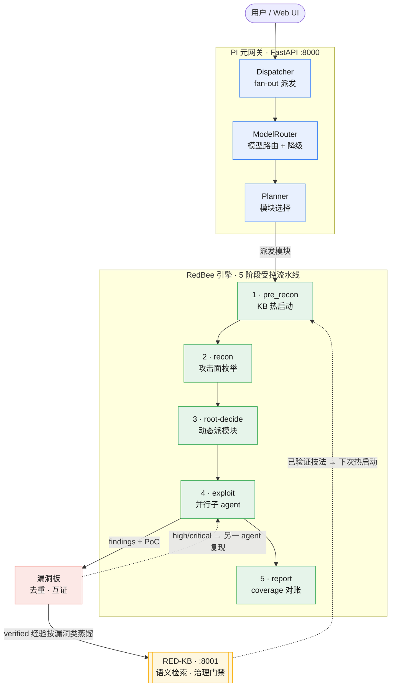

# RedBee — 自研 AI 渗透智能体

> 给定一个目标，它自己侦察、自己打、自己出带 PoC + 证据的报告。
> **每打完一次，成功经验按漏洞类自动蒸馏进知识库，下次同类目标更快更准。**

[English](README.md) | [简体中文](README.zh-CN.md)

[](LICENSE)

---

## 一秒了解它



**一句话**：AI 渗透不只是"跑一次"，而是**越打越准**——经验自动沉淀为知识库资产。

---

## 为什么做这件事

AI 渗透目前有三个结构性难题没解决：

| 难题 | 表现 | 根源 |
|---|---|---|
| **不稳定** | 模型卡住、跑偏、无限重试、跑几小时不收敛 | 把"渗透"整条交给 LLM 自由发挥，无受控边界 |
| **无记忆** | 换个目标/环境就重新从零摸索，经验留在报告里用不上 | 无持久知识库，或 KB 与执行链路脱节 |
| **验证不可信** | AI 自己说自己挖到了，误报高 | 发现者=验证者，无独立复现 |

**我们的主张**：渗透是「经验活」。把经验系统化、可复用、能累加，才是 AI 渗透的核心竞争力——而不是比谁的 prompt 更长、谁的工具更多。

---

## 实测成果

### 真实漏洞靶场（DVWA）
- **33 条 findings**（4 critical / 19 high / 9 medium / 1 low）
- 覆盖 SQLi（报错 + 盲注）/ XSS（反射 + 存储）/ Upload→RCE / Brute Force / Session / Command Injection / CSRF / IDOR / CAPTCHA / Misconfig

### OWASP LLM Top 10（llmvault）
- 同一 session 解完 10 个 core lab
- `core_done:true`，2400 分，flag 全从 live 响应提取

### 知识库（RED-KB）
- **1517 条**知识条目（630 attack_primitive / 881 poc）+ 147 条攻击案例
- 一次完整渗透 → **10 类通用技法全部回流为 authoritative**，`kb_query` 各类均 top 命中可检索

> **冷启动不空白**：仓库已随 `redkb.seed` 内置 175 个实战 skill + 上述种子知识库，首次运行即可派上用场；之后每打一次，经验继续回流，库越来越厚。

---

## 核心特性

### 知识回流闭环

```
渗透 → submit_finding(带 PoC + 证据) → 治理门禁(是否带 working PoC)
  → 按漏洞类分蒸馏 → authoritative 提升 → 下次 kb_query 命中 → 热启动
```

**铁律**：只有带 working PoC + 证据的实战经验才入库。空喊"疑似漏洞"不进 KB。

这意味着：它不是用完即弃的工具，而是**越用越强的资产**。

### 护栏四件套

1. **输入验证**：所有工具调用参数校验，友好错误
2. **输出截断**：工具输出 8000 字符封顶，防 context 膨胀
3. **上下文压缩**：按总大小 80000 触发，从最老 tool output 起换占位符
4. **Skill 注入截断**：大 skill（23K+）取前 8000 字符

### 63 个工具 + OpenAI Function Calling

工具按来源分层：文件系统（读/bash/edit）→ 渗透工具（nmap/sqlmap/terminal）→ 浏览器（playwright）→ DB 操作（memory/findings）→ KB 查询（kb_query/store）→ HTTP 请求。

LLM 通过结构化 function calling 决定调什么工具，不靠"模型输出 JSON 文本"这种不可靠方式。

### 175 个 Skill 库

经 `list_skills` / `load_skill` 工具按需加载，覆盖：
- **vulnerabilities**（87）：SQLi / XSS / SSRF / Auth Bypass / IDOR / RCE 等
- **reconnaissance**：信息收集、端口扫描、子域枚举
- **reporting**：Triage 7-Question Gate、报告模板、证据 hygiene
- **enterprise**：M365、Okta、vCenter、云 IAM
- **methodology**：Bug Bounty 方法论、SRC 挖洞、渗透测试流程
- **tooling**：nmap / sqlmap / nuclei / httpx / ffuf 等命令行 playbook
- **protocols**：GraphQL / WebSocket / OAuth
- **technologies**：Django / Express / FastAPI / Next.js / 云服务
- **cloud**：AWS / Azure / GCP / Kubernetes

### Skills vs RED-KB：经验的两个载体

Skills 和 RED-KB 是两类不同的经验资产，在一次任务中分工协作：

> **Skills = 教科书（静态）；RED-KB = 战地日记（动态）。**

|  | **Skills**（175 个 .md） | **RED-KB**（1500+ 知识条目 + 案例库） |
|---|---|---|
| **是什么** | 方法论 / 操作手册 | 成功经验 + 实证 PoC |
| **来源** | 蒸馏自开源引擎与公开披露报告（Strix / Shannon / Claude-BugHunter） | **我们自己的渗透任务自动回流**，每跑一次就长一点 |
| **会变吗** | ❌ 静态，需人工添加 | ✅ 自动增长：运行中 finding 逐条入 poc + 收口按漏洞类蒸馏成通用技法 |
| **怎么查** | `load_skill("sql-injection")`——**按名字**取 | `kb_query("JWT 怎么绕过")`——**语义检索**（向量相似度） |
| **内容** | "这类漏洞通用怎么打、用什么工具、注意什么" | "上次实际用这条 PoC 打穿了这类问题（去标识化，跨靶场可迁移）" |
| **治理** | 人工策展质量 | 门禁：verified / sanitized / scope，未验证的经验挡在检索外 |

**一次任务里的配合**：

1. 派发时自动注入**模块 skill** 进子 agent prompt（sqli 模块 → sql-injection 教科书）
2. agent 运行中用 `kb_query` 翻**战地日记**（"这种情况我们之前怎么破的？"）
3. 打出 finding → **回流 RED-KB**（skills 永远不变）
4. 下次任务：教科书没变，日记厚了 → 同类题更快打通

类比：Skills 是《内科学》教材，RED-KB 是主治大夫自己的病例本——教材教通用原理，病例本记"这种病人我实际怎么治好的"，而且只有真正治好过、带证据的才收进病例本。

### 模型路由 + 自动降级

```python
# .env 配置
MODEL_PRIORITY=DeepSeek-V4-Flash,qwen3.8-27b
# 首选挂 → 自动降级到备用，无需改代码
```

---

## 适用场景

这不是一个"打 CTF 用"的工具。它面向的是**真实渗透测试全流程**：

| 场景 | 怎么做 |
|---|---|
| **Web 应用渗透** | `POST /api/task {target, session_id, task: "全模块渗透"}` |
| **API 安全测试** | 提供 OpenAPI schema，自动枚举端点并攻击 OWASP API Top 10 |
| **LLM 应用安全** | 针对 LLM 靶场按 OWASP LLM Top 10 逐类突破 |
| **企业资产侦察** | 给定 IP/域名，自动枚举攻击面 + 漏洞验证 |
| **持续知识积累** | 每次渗透结果回流 KB，团队共享经验 |

已知靶场（有 `data/targets/<id>.md` 档案的，如 dvwa/juice）在 `PIMETA_KNOWN_FAST=1` 时跳过侦察、直接热启动。真实目标直接给 URL 或 IP 即可，跑完会自动沉淀靶场档案，下次同类目标更快。

---

## 快速开始

### 前提

- Python 3.11+
- pip
- **OpenAI 兼容 LLM 端点 + API Key**（必填；如 vLLM / DeepSeek / OpenAI 等）
- embedding 端点（可选；不填 RED-KB 语义检索退化为关键词检索）
- Docker（**推荐必装**：Kali 攻击沙箱跑在 Docker 容器里，sqlmap 利用/terminal 等渗透工具依赖它；
  无 Docker 时仅 HTTP/浏览器/宿主 nmap 类侦察可用）
- nmap（宿主侧，`apt install nmap`）

### 1. 克隆并安装依赖

```bash
git clone <repo-url>
cd <repo>
pip install -r platform/requirements.txt
python -m playwright install chromium --with-deps   # browser 工具用（不用浏览器可跳过）
```

### 2. 配置

```bash
cp platform/config.example.env platform/.env
# 填入 LLM 端点/Key（第 1 节，必填）；embedding 端点（第 2 节，可选）
```

### 3. 构建 Kali 攻击沙箱镜像（Docker 部署跳过本步，compose 会自动构建）

```bash
docker build -f Dockerfile.kali -t redbee-kali:local .
```

### 4. 初始化知识库 + 启动服务

```bash
cd platform
python3 -m redkb.seed          # 初始化 RED-KB（幂等，重复运行无害）
bash run.sh                    # 启动 RED-KB(:8001) + PI 网关(:8000)
```

`run.sh` 一步启动两个服务。若需分离模式：
```bash
bash start_redkb.sh   # RED-KB :8001（后台，绑定 0.0.0.0）
bash start_pimeta.sh  # PI 网关 :8000（后台，绑定 0.0.0.0）
```
`start_*.sh` 绑定 `0.0.0.0`，局域网/容器内可直接访问。

### 5. 准备一个目标（可选）

引擎打**任意授权目标**（URL / IP）。想先拿公开靶场练手，用官方仓库即可（本仓库不捆绑靶场源码）：

```bash
# DVWA（经典 Web 漏洞靶场；登录 admin/password，先点 "Create/Reset Database"）
docker run -d -p 8081:80 citizenstig/dvwa

# OWASP Juice Shop
docker run -d -p 3000:3000 bkimminich/juice-shop
```

或直接指向你自己部署的目标。

### 6. 派发任务

```bash
curl -X POST http://127.0.0.1:8000/api/task \
  -H "Content-Type: application/json" \
  -d '{
    "target": "http://127.0.0.1:8081",
    "target_id": "dvwa",
    "session_id": "my-first-session",
    "task": "对目标进行全模块渗透测试"
  }'
```

### 7. 查看进度

```bash
# 实时快照
curl http://127.0.0.1:8000/api/task/{task_id}/live

# SSE 流式推送（推荐）
curl -N http://127.0.0.1:8000/api/task/{task_id}/stream

# 漏洞板
curl http://127.0.0.1:8000/api/task/{task_id}/board
```

---

## Docker 部署

### 构建并运行（标准方式）

全部镜像由本仓库构建，无需外部镜像：

```bash
cp platform/config.example.env platform/.env   # 填入真实 LLM key

# 构建 Kali 沙箱镜像（自包含：Dockerfile.kali，基于公开 kalilinux/kali-rolling）
docker compose --profile sandbox build

# 构建并启动网关 + RED-KB
docker compose up -d --build
```

### 拉取预构建镜像（仅在已发布 release 后）

[GitHub Actions](./.github/workflows/ci.yml) 在打 `v*` tag 时构建多架构（amd64/arm64）镜像并发布到 GHCR。有 release 之后：

```bash
export REDBEE_IMAGE=ghcr.io/<owner>/<repo>:latest
export REDBEE_KALI_IMAGE=ghcr.io/<owner>/<repo>/redbee-kali:latest
docker compose pull && docker compose up -d
```

> Kali 沙箱镜像自包含、可复现构建；也可通过 `HINSE_DOCKER_IMAGE` 换成你手上任意可用的 Kali 镜像。

### 网络要点（docker 后怎么打靶场）

- 网关容器通过挂载的宿主 Docker socket（`/var/run/docker.sock`）调**宿主 daemon** 启动
  Kali 沙箱（`inhouse-sess-*`，`--network bridge`）——沙箱是宿主的**兄弟容器**，
  攻击目标网络（如宿主的 docker bridge）行为与源码直接运行**完全一致**，无回归。
- 唯一变化：网关容器内访问 RED-KB 用 compose 服务名 `redkb:8001`（compose 已配好），
  不再是 `127.0.0.1`（容器内回环指不到另一服务）。

---

## 项目结构

```
platform/
├── pi_meta/                  # PI 元网关（FastAPI）
│   ├── app.py                # Web / 会话 / 任务 / 报告
│   ├── orchestrator.py       # 漏洞板协调层（贴板/去重/派另一agent复现）
│   ├── board.py              # findings 板
│   ├── planner.py            # 模块选择
│   ├── model_router.py       # 模型路由 + 自动降级
│   └── real_dispatch.py      # 引擎分发
├── agents/
│   ├── executor.py           # InhouseAgent（ReAct 循环 + 护栏 + memory）
│   ├── orchestrator_v2.py    # 5 阶段受控编排
│   └── skills/               # 175 个 skill 包
├── redkb/                    # RED-KB 知识库服务（:8001）
├── auto_ingest.py            # 知识回流闭环（task done → 按漏洞类蒸馏 → 入库）
├── config.py                 # 统一配置（读 .env）
├── requirements.txt
└── tests/
```

`data/` 是运行时数据（`redkb.db` 知识库 + `targets/<id>.md` 靶场档案），首次运行自动创建，不入库。

---

## 设计文档

架构与知识库的设计细节见项目 Wiki / Issues。核心模块（`pi_meta/`、`agents/`、`redkb/`）的 docstring 里也有对应说明。

自部署遇到问题先看 **[TROUBLESHOOTING.md](TROUBLESHOOTING.md)**（连接/沙箱/LLM 超时/知识库检索等常见坑）。

---

## 社区与贡献

- **Issue**：欢迎提 bug、建议、新 skill 贡献
- **Skill 贡献**：按 `skills/README.md` 格式写一个 markdown 提 PR
- **知识回流**：提交 `submit_finding` 带 PoC + 证据，自动蒸馏进 RED-KB

---

## License

MIT — 见 [LICENSE](LICENSE)

> 注：`platform/agents/skills/` 内含蒸馏自其他开源项目的 skill，各自保留原有许可证与署名（见该目录 `LICENSE` / `PROVENANCE.md`）。
